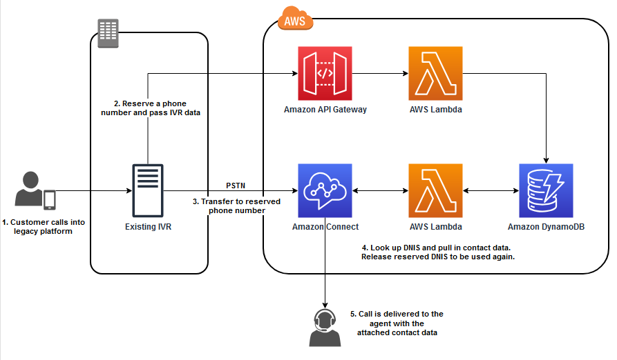

Transfers from Legacy Platform into Amazon Connect

 
Solution Overview
Customers migrating from an existing on premises platform or CCaaS solution may need to transfer calls from that legacy platform to Amazon Connect while maintaining context.  Maintaining context when transferring calls between platforms ensures that customers aren’t having to re-enter information that has been captured in the legacy platform.
Maintaining context when transferring calls between platforms reduces customer effort and improves customer experience by not making customers start over when the call is transferred between platforms. 
The recommended pattern to accomplish this with Amazon Connect is a technique known as rolling DNIS where a pool of phone numbers are claimed within Amazon Connect that can be used as a unique identifier for these transfers. Customers can use either direct dial(DID) or toll-free numbers(TFN).  TFN offer carrier resiliency, but do have a slightly higher cost.  DID numbers are tied to a single carrier and limited on the number of concurrent calls they can support. 
The data captured in the legacy platform will be stored in an intermediary data store such as Amazon DynamoDB and then retrieved by AWS Lambda in an Amazon Connect flow.  
This pattern has several advantages in that it works globally, at any scale, and for transfers that occur during interactive voice response(IVR) treatment or agent-initiated transfers.  It can also be used for transfers from Amazon Connect to an external system.
The example here will focus on the IVR transfer but the same concepts apply to agent transfers by having the CTI client of the sending agent query the rolling DNIS solution in the same manner as the IVR example here.
 

 
How it works:

1. The customer dials into the legacy platform and interacts with the IVR entering the information required by the IVR to route the call(i.e. customer#, account#, claim#, etc.).
2. When the customer reaches a point in the IVR flow where the call needs to be routed to Amazon Connect the legacy platform calls an AWS Lambda function which checks out a phone number from the pool of available numbers and updates the Amazon DynamoDB table with the associated customer data that has been collected. If no number is available the Lambda function will release any number checked out longer than two minutes.
3. The legacy platform transfers the call to Amazon Connect via the reserved phone number
4. The Amazon Connect flow invokes a Lambda function that performs a look up in the DynamoDB table based on the number dialed and updates the contact attribute(s) with the data returned.  The number then is released back into the pool to be reused.
5. Based on the attribute values defined by the customer data the call is routed to the appropriate queue in Amazon Connect. The call is delivered to an Amazon Connect agent with all of the customer data is available to that agent as contact attributes within their Agent Workspace or custom CCP.  The data can be used to invoke a step-by-step guide or be passed to a third-party application.

 Solution walk through:  Build a rolling DNIS solution to transfer calls into Amazon Connect

The steps below will guide you through the process of deploying the rolling DNIS solution.  Section 1 will deploy the CloudFormation stack.  Section 2 will will configure Amazon Connect and Section 3 walks you through testing the solution. 

Prerequisites

1. Have an AWS account
2. Have an understanding of Amazon Connect, Lambda, DynamoDB and AWS Identity and Access Management (IAM)
3. Have permissions to deploy CloudFormation stacks, create IAM policies, create CloudWatch logs, create and modify API gateways,  create and modify DynamoDB tables, create and modify Lambda functions, associate Lambda functions with your Connect instance, claim phone numbers in Amazon Connect, create and modify Amazon Connect flows. 
4. Have an existing Amazon Connect instance or create a new one for inbound and outbound calls, and claim two new phone numbers. The Get started with Amazon Connect documentation (the first two steps) provides valuable background knowledge for this process.

Section 1:  Deploy AWS CloudFormation template

1. Clone the repo
2. Unzip the folder on your local machine and note the location.
3.  Navigate to the CloudFormation dashboard within the AWS console and create a CloudFormation stack using the file named “apiGatewayWithLambda.yaml.” 
4. Provide a Stack name
5. Create the stack.
6.  After the stack is successfully launched, copy the following output. It could take a few minutes for the stack to launch the solution. 
    1. ApiUrl – This is the API Gateway URL you will use to test the solution. You can find this in the Output tab for the stack.
7. Navigate to AWS Lambda in the AWS console
8. Create a new function
9. Name it rollingDnisShim, change Runtime to Python 3.12 and choose create function.
10. Remove all existing text from the code window
11. Browse to the folder where you extracted the zip file and the ivrTest subfolder
12. Open rollingDnishShim_py.py in your text editor and copy the contents
13. Paste the contents into the code window and click on “Deploy“
14.  Click on configuration and Environment variables.
15. Click edit and Add environment variable.
16. Enter “apigw” as the key and pass the ApiUrl value you copied in step 6. 
17. Save your changes. 

Section 2:  Configure Amazon Connect

1. Browse to Amazon Connect in the AWS Console
2. Click on the instance you want to use.  If you have not yet created your instance please follow the steps in the  Get started with Amazon Connect documentation.
3. Choose flows on the left hand hand column and scroll down until you find AWS Lambda
4. From the drop down choose “rollingDnis_py” and click “+Add Lambda Function”  you can search in the drop down if you have a large number of Lambda functions
5. Repeat step 4 choosing “rollingDnisShim” to associate our test function.
6. Log into the Amazon Connect instance with an Admin user.
7. Navigate to flows again and choose create flow.
8. Click on the triangle to the right of save and select “Import (beta)” browse to the location where you extracted the cloned repo and into the resource subfolder choosing the rollingDnisReceive.json file and click import.
9. In the flow editor click on the set working queue block and choose the queue you would like calls being transferred from the legacy platform to be placed in and save the change.
    1. Note:  You can also set this dynamically based on contact attributes, but we will be keeping this simple for the purposes of this example. 
10. Click on the “Invoke AWS Lambda function block” and choose “rollingDnis_py” from the drop down and save the change.
11. Save and Publish your rollingDnisReceive flow.
12. Navigate to flows and choose create flow.
13. Click on the triangle to the right of save and select “Import (beta)” browse to the location where you extracted the cloned repo and into the ivrTest subfolder choosing the rollingDnisSend.json file and click import.
14. Click on the “Invoke AWS Lambda function block” and choose “rollingDnisShim” from the drop down and save the change.
15. Save and Publish your rollingDnisSend flow.
16. Navigate to phone numbers and choose claim a phone number.   
17. Choose voice, Toll free, your country, select a number from the list and associate it to your “rollingDnisSend” flow and save.

Note: You can choose either TFN or DID numbers for steps 17 and 18.  For this example to keep it simple we are choosing TFN for the number you are going to call and DID for the number being used for the transfer

1. Choose claim a number again, choose voice, DID, your country, a specific prefix if you would like, select a number from the list and associate it to your “rollingDnisReceive” flow and save. 
2. In the AWS console navigate to DynamoDB, Tables, and the rollingDNISTable.
3. Choose explore table items.
4. Choose create table item and click on JSON view.

Note: if “View DynamoDB JSON” is toggled ON → Confirm that it is toggled OFF before proceeding to the next step.

1. Replace what is in the box with { "dnis": "+15555555204", "inuse": "false", "target": "development" }
2. Update +15555555204 to the phone number you mapped to the rollingDNISreceive flow in step 18. 
3. Click create item.

Section 3: Testing

1. Place an inbound call to the TF number you claimed in section 2 step 17
2. You will be prompted to enter a five digit account number.  Pick any five digit number
3. You will hear a message in a male voice that the account lookup has failed and you will be transferred.
4. You will then hear a message in a female voice reading back the account number and the reason for the call.
5. This demonstrates that the information entered(account number) is being passed successfully.
6. You can also pull up the contact in Contact Search and validate that the account number and customer phone number are correctly set as contact attributes.  

Note: Update the Contact Status filter to include both In Progress and Completed contacts so you see the call in progress. 

Conclusion

This AWS sample deploys a solution which enables you to transfer data between two contact center platforms using AWS Lambda, Amazon API Gateway, Amazon DynamoDB and Amazon Connect flows making it easier for customers to migrate to Amazon Connect. 

IGNORE Everything below this line

 Github AWS Sample to be created with sample code for DynamoDB table, API gateway, Lambda Function, event bridge rule and  flows.

https://medium.com/@rajatagr2002/amazon-connect-transfer-call-data-ec34842fc509

DynamoDB table

Field name	data type	key	description
dnis	number	partition	Phone number in Amazon Connect which will be used to transfer the call from the legacy platform to Amazon Connect. This is the unique identifier that will be used by the Connect flow to associate all the customer data with the contact in Amazon Connect
available	string		Is the dnis currently in use
lastupdated_inuse	string		Time stamp of the last time the number was marked in use
lastupdated_avail	string		Time stamp of the last time the number waws marked available
source_id	string		Unique identifier from legacy platform
source_request_time	string		Time stamp of request from the legacy platform
customer_data1	string		Customer data is just an example. Field name can be anything that is relevant to the data being based and matches up to what the Connect flow is expecting
customer_data2	string		
customer_data3	string		
customer_dataX			

Lambda function to check out number and update customer data

Allocate DNIS function

This Lambda function pulls all DNIS records that are checked in, then selects one at random, and checks it out
Q: Why at random instead of ‘oldest’? A: Because this lowers the odds of two simultaneous calls “grabbing” the same DNIS for use
var AWS = require("aws-sdk");
var docClient = new AWS.DynamoDB.DocumentClient();
exports.handler = (event, context, callback) => {
var currentTime = (new Date()).getTime();
console.log(event.Details);
/// build the query that finds all DNIS' that are 'checked in'
var Avail = "in";
var paramsQuery = {
TableName: 'TranslationRoutingDB',
FilterExpression: "Avail = :varNumber",
ExpressionAttributeValues: { ":varNumber": Avail }
};
docClient.scan(paramsQuery, function(err, data) {
if (err) {
console.log(err);
callback(null, buildResponse(false));
}
else {
console.log("DynamoDB Query Results:" + JSON.stringify(data));
if (data.Items.length === 0) {
console.log("No Available DNIS");
var Avail = "noAvail";
callback(null, buildResponse(true, Avail));
}
else {
console.log("Avail DNIS");
// Pick a random data item that is checked in and set variables for update
var selectRecord = Math.floor(Math.random() * (data.Count - 1 + 1));
var DNIS = data.Items[selectRecord].DNIS;
var checkoutStamp = currentTime;
var customerData = event.Details.ContactData.Attributes.customerData;
// Update TranslationRoutingDB to checkout item and place customer data
var paramsUpdate = {
TableName: 'TranslationRoutingDB',
Key: { "DNIS": DNIS },
ExpressionAttributeValues: { ":var1": currentTime, ":var2": "out", ":var3": customerData, },
UpdateExpression: "SET checkoutStamp = :var1, Avail = :var2, customerData = :var3"
};
docClient.update(paramsUpdate, function(err, data) {
if (err) {
console.log("Unable to update TRDB. Error: ", JSON.stringify(err, null, 2));
callback(null, buildResponse(false));
}
else {
console.log("Update TRDB success: ");
callback(null, buildResponse(true, Avail, DNIS, customerData));
}
});
}
}
});
};
function buildResponse(isSuccess, Avail, DNIS, customerData) {
if (isSuccess) {
return {
Avail: Avail,
DNIS: DNIS,
customerData: customerData,
lambdaResult: "Success"
};
}
else {
console.log("Lambda returned error to Connect");
return { lambdaResult: "Error" };
}
}

Error handling - what is the desired behavior on the legacy platform if there are no available numbers to check out? 

* Transfer anyway to the “main” number in Connect which will have no context?
* Play an error message saying your call cant be routed and create a task in Connect with all the customer data so an agent can call them back? 
* Play a message saying please wait, Wait x seconds and retry?

Amazon Connect Flow

Retrieve customer data Lambda function

Lambda Function:
This Lambda function uses the calling DNIS as the key to retrieve customerData, and checks the DNIS back in, and available for use again.
var AWS = require("aws-sdk");
var docClient = new AWS.DynamoDB.DocumentClient();
exports.handler = (event, context, callback) => {
var currentTime = (new Date()).getTime();
var DNIS = event.Details.ContactData.SystemEndpoint.Address;
var paramsQuery = {
TableName: 'TranslationRoutingDB',
KeyConditionExpression: "DNIS = :varNumber",
ExpressionAttributeValues: { ":varNumber": DNIS }
};
docClient.query(paramsQuery, function(err, data) {
if (err) {
console.log(err);
callback(null, buildResponse(false));
}
else {
console.log("DynamoDB Query Results:" + JSON.stringify(data));
if (data.Items.length === 0) {
console.log("DNIS not Found in TranslationRoutingDB");
var Avail = "notFound";
callback(null, buildResponse(true, Avail));
}
else {
console.log("Valid DNIS");
if (data.Items[0].Avail === "in") {
console.log("DNIS Not Checked Out");
var Avail = data.Items[0].Avail;
callback(null, buildResponse(true, Avail, currentTime));
}
else {
var checkoutStamp = data.Items[0].checkoutStamp;
var checkinStamp = data.Items[0].checkinStamp;
var customerData = data.Items[0].customerData;
var paramsUpdate = {
TableName: 'TranslationRoutingDB',
Key: { "DNIS": DNIS },
ExpressionAttributeValues: { ":var1": currentTime, ":var2": "in", ":var3": "none", },
UpdateExpression: "SET checkinStamp = :var1, Avail = :var2, customerData = :var3"
};
docClient.update(paramsUpdate, function(err, data) {
console.log("Dynamo Update Success: ");
if (err) {
console.log("Unable to update TRDB. Error: ", JSON.stringify(err, null, 2));
callback(null, buildResponse(false));
}
else {
console.log("Update TRDB success: ");
callback(null, buildResponse(true, checkinStamp, checkoutStamp, customerData, Avail, currentTime));
}
});
}
}
}
});
};
function buildResponse(isSuccess, checkinStamp, checkoutStamp, customerData, Avail, currentTime) {
if (isSuccess) {
return {
checkinStamp: checkinStamp,
checkoutStamp: checkoutStamp,
customerData: customerData,
Avail: Avail,
lambdaResult: "Success"
};
}
else {
console.log("Lambda returned error to Connect");
return { lambdaResult: "Error" };
}
}

Does the function need to be updated to not release the DNIS until the contact finishes? 
Initial thought was to use disconnect flow to release the DNIS, but is that necessary or once the flow completes and the call is in queue can the DNIS be released? 

EventBridge rule

Create an event bridge rule to run on a schedule that calls a Lambda function to release DNIS that have been in use longer than X minutes

Orphan Records Sample:
On occasion, a DNIS will be checked out and never answered (customer hangs up mid-transfer). This process identifies records that have been checked out more than 5 minutes ago, and checks them back in. In my pilot, it is scheduled to run every 4 hours.
Lambda Function:
var AWS = require("aws
sdk");
var docClient = new AWS.DynamoDB.DocumentClient();
exports.h
andler = (event, context, callback) => {
//set a variable for 5 minutes ago
var expiredTime = (((new Date()).getTime()) 300000);
/// build the query that finds all DNIS' that are 'checked
var Avail = "out";
var paramsQuery = {
TableName: ' TranslationRoutingDB',
FilterExpression: "Avail = :var1 AND checkoutStamp < :var2",
ExpressionAttributeValues: { ":var1": Avail, ":var2": expiredTime }
docClient.scan(paramsQuery, function(err, data) {
if (err) {
console.log(err);
callback (null, buildResponse(
else {
console.log("DynamoDB Query Results:" + JSON.stringify(data));
if (data.Items.length === 0) {
console.log("No Orphaned DNIS");
var Avail = "ok";
callback(null, buildResponse(true, Avail));
else {
console.log("Checked Out DNIS Found");
// checkin orphaned records within TranslationRoutingDB
for (var numRecord = data.Count; numRecord > 0; numRecord ----)
var DNIS = data.Items[(numRecord var DNIS = data.Items[(numRecord -- 1)].DNIS;1)].DNIS;
var currentTime = (nevar currentTime = (new Date()).getTime();w Date()).getTime();
var paramsUpdate = {var paramsUpdate = {
TableName: 'TranslationRoutingDB',TableName: 'TranslationRoutingDB',
Key: { "DNIS": DNIS },Key: { "DNIS": DNIS },
ExpressionAttributeValues: { ":var1": currentTime, ":var2": ExpressionAttributeValues: { ":var1": currentTime, ":var2": "in", ":var3": "none" },"in", ":var3": "none" },
UpdateExpression: "SET checkinStamp = :varUpdateExpression: "SET checkinStamp = :var1, Avail = :var2, 1, Avail = :var2, customerData = :var3"customerData = :var3"
};};
docClient.update(paramsUpdate, function(err, data) {docClient.update(paramsUpdate, function(err, data) {
if (err) { if (err) {
console.log("Unable to update TRDB. Error: ", console.log("Unable to update TRDB. Error: ", JSON.stringify(err, null, 2));JSON.stringify(err, null, 2));
callback(null, buildResponse(false));callback(null, buildResponse(false));
}}
else {else {
console.log("Update TRDB success: ");console.log("Update TRDB success: ");
callback(null, buildResponse(true));callback(null, buildResponse(true));
}}
});});
}}
}}
}}
});});
};
};
function buildResponse(isSuccess) {
function buildResponse(isSuccess) {
if (isSuccess) {if (isSuccess) {
return {return {
lambdaResult: "Success"lambdaResult: "Success"
};};
}}
else {else {
console.log("Lambda returned error to Connect");console.log("Lambda returned error to Connect");
return { lambdaResult: "Error" };return { lambdaResult: "Error" };
}}
}
}

Calculate how many phone numbers are required to handle traffic in production (added by Ying Qian)

To determine the number of Direct Inward Dialing (DID) phone numbers needed for efficient call handling in a production environment, we use the Erlang B formula:
 
GoS = (EM/M!)/(∑Mn=0 En/n!)
 
Where:
- GoS (Grade of Service): The probability of a call's data gets lost. Lower values (e.g., <0.05) indicate better efficiency, while higher values (e.g., >0.1) suggest a high rate of calls whose data can't be transferred. properly.
- E (Erlang value): Represents traffic intensity, calculated as average calls per busy hour × average duration of a phone number reservation in hours.
- M: Number of DID phone numbers required.
 
For example:
- 3400 calls per busy hour
- 5 seconds average duration of a phone number reservation
- E = (3400 × 5) / (60 × 60) = 4.722 Erlang value
- Target GoS = 0.001 (1 in 1000 calls could lose its data during transfer)
 
The 5-second average duration of a phone number reservation is calculated based on the time needed for data exchange between an on-premise system and an Amazon Connect instance. This includes:
- Read, write, and delete transactions in a database table
- PSTN call connection setup
 
The Python function uses an iterative approach to solve this equation, starting with an initial guess for M and adjusting it until the calculated GoS closes the target.

// MIT No Attribution
// Copyright Amazon.com, Inc. or its affiliates. All Rights Reserved.
// Permission is hereby granted, free of charge, to any person obtaining a copy of this
// software and associated documentation files (the "Software"), to deal in the Software
// without restriction, including without limitation the rights to use, copy, modify,
// merge, publish, distribute, sublicense, and/or sell copies of the Software, and to
// permit persons to whom the Software is furnished to do so.
// THE SOFTWARE IS PROVIDED "AS IS", WITHOUT WARRANTY OF ANY KIND, EXPRESS OR IMPLIED,
// INCLUDING BUT NOT LIMITED TO THE WARRANTIES OF MERCHANTABILITY, FITNESS FOR A
// PARTICULAR PURPOSE AND NONINFRINGEMENT. IN NO EVENT SHALL THE AUTHORS OR COPYRIGHT
// HOLDERS BE LIABLE FOR ANY CLAIM, DAMAGES OR OTHER LIABILITY, WHETHER IN AN ACTION
// OF CONTRACT, TORT OR OTHERWISE, ARISING FROM, OUT OF OR IN CONNECTION WITH THE
// SOFTWARE OR THE USE OR OTHER DEALINGS IN THE SOFTWARE.
// Author: Ying Qian 
import math
import json

def calculate_gos(E, M):    # Erlang B Formula
    numerator = (E**M) / math.factorial(M)
    denominator = sum((E**n) / math.factorial(n) for n in range(M+1))
    return numerator / denominator

def lambda_handler(event, context):
    calls = 3400    # Average calls per busy hour - to be changed according to your cc traffic in production.
    duration = 5/(60*60)   # Average duration of a phone number reservation in hours - to be changed depends on real reservation time.
    E = calls*duration # Erlang value
    print(f"Erlang value: {E}")
    target_gos = 0.001  # GoS (Grade of Service): The probability of a call's data gets lost. - to be changed according to your target.
    M = 1  # Initial guess for required phone numbers
    previous_operator="" # Keep the value of previous operator for comparing which calculated GoS closes enough the targeted GoS. 

    while True:
        gos = calculate_gos(E, M)
        print(f"The value of gos is {gos} with m: {M}")
        if gos > target_gos:
            operator = "plus"
            if (previous_operator ==  "minus"): # The target GoS falls between two consecutive calculated values.
                if abs(previous_gos - target_gos) < abs(gos - target_gos):  # the previous calculated value closes the target GoS.
                    break
                else:
                    M += 1
                    break
            M += 1
        else:
            operator = "minus"
            if (previous_operator ==  "plus"):  # The target GoS falls between two consecutive calculated values.
                if abs(previous_gos - target_gos) > abs(gos - target_gos):  # the current calculated value closes the target GoS.
                    break
                else:
                    M -= 1
                    break
            M -= 1
        previous_gos = gos
        previous_operator = operator

    result = {'Minimum phone numbers': M} # Required phone numbers
    print(f"Average calls per busy hour: {calls}")  
    print(f"Average duration of a phone number reservation in hours: {duration}")  
    print(f"Target GoS (Grade of Service): {target_gos}")  
    print(f"=> Minimum phone numbers required: {M}") 
    return result

The output of the function by given data is: 

Status: Succeeded
Test Event Name: test
Response:
{
  "Minimum phone numbers": 13
}
Function Logs:
START RequestId: 5e3c3452-dbc7-4629-a87b-fdcf14d5c978 Version: $LATEST
Erlang value: 4.722222222222222
The value of gos is 0.8252427184466019 with m: 1
The value of gos is 0.6608433183938535 with m: 2
The value of gos is 0.5098558995506045 with m: 3
The value of gos is 0.3757464569278896 with m: 4
The value of gos is 0.2619227088994224 with m: 5
The value of gos is 0.17091082441649716 with m: 6
The value of gos is 0.10337783236614845 with m: 7
The value of gos is 0.05751215151830009 with m: 8
The value of gos is 0.029292203572777755 with m: 9
The value of gos is 0.013643703893180122 with m: 10
The value of gos is 0.005823039222088001 with m: 11
The value of gos is 0.00228623492060336 with m: 12
The value of gos is 0.0008297808417378427 with m: 13
Average calls per busy hour: 3400
Average duration of a phone number reservation in hours: 0.001388888888888889
Target GoS (Grade of Service): 0.001
=> Minimum phone numbers required: 13
END RequestId: 5e3c3452-dbc7-4629-a87b-fdcf14d5c978
REPORT RequestId: 5e3c3452-dbc7-4629-a87b-fdcf14d5c978  Duration: 17.55 ms  Billed Duration: 18 ms  Memory Size: 128 MB Max Memory Used: 32 MB  Init Duration: 104.00 ms
Request ID: 5e3c3452-dbc7-4629-a87b-fdcf14d5c978

Best Practice for phone number allocation: To ensure optimal performance and account for unexpected spikes in call volume, it's recommended to add a buffer, 15% for example to the calculated minimum number of phone numbers. In this case:  13 x (100 + 15)% = 15. By implementing a headroom, the call center can comfortably handle the expected call volume while also maintaining a safety margin for unforeseen increases in traffic. This approach helps to maintain service quality and minimize the risk of call rejections during peak times or unexpected surges in call activity.

Alternatively, you can use the online Erlang B calculatorinstead of using the Python function above. (However, to write an AWS blog, it might be better to use our own function instead of referencing an external resource.)

